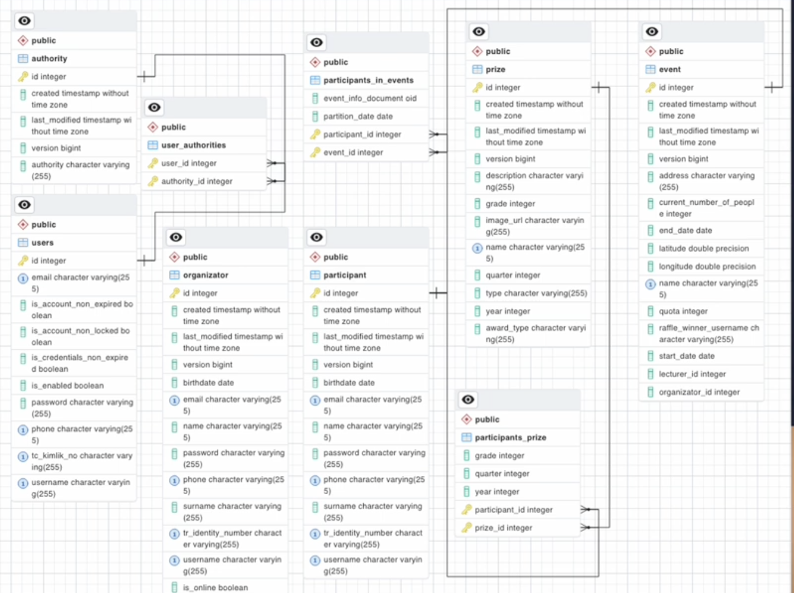

# School Events Award System (SEAS)

[](https://react.dev/)
[](https://spring.io/projects/spring-boot)
[](https://www.postgresql.org/)

**SEAS** helps schools track student participation at events, award points, and run transparent prize drawings. It provides dashboards for students and administrators, an automated raffle by grade at the end of each quarter, and exports for analysis.

-  **Demo video:** https://youtu.be/7EcdafCRrHg  
- **Repository:** https://github.com/MoominRJK/SEAS.git

---

## Architecture
The app is a classic 3‑tier web system: React (UI) → Spring Boot (REST API) → PostgreSQL (DB).


---

## Major Features


- Track student participation and attendance at school events.
- Automatically generate **raffle winners by grade** at each quarter end.
- **Student & Admin dashboards** to manage events, points, and prizes.
- Data stored in **PostgreSQL** with scheduled backups.
- Export data to **CSV or PDF** for easy analysis.

---

## Data Model (ERD)


---

## UI – Landing Page


---

## How to Run (Local Development)

### Prerequisites
- **Node.js 18+** and **npm** (or yarn) for the React frontend.
- **Java 17+** and **Maven** or **Gradle** for the Spring Boot backend.
- **PostgreSQL 14+** running locally (or Docker).

### 1) Clone the repository
```bash
git clone https://github.com/MoominRJK/SEAS.git
cd SEAS
```

### 2) Start PostgreSQL
**Option A — Local install**
- Create a database, e.g. `seas`
- Create a user with password and grant privileges.

**Option B — Docker (example)**
```bash
docker run --name seas-postgres -e POSTGRES_DB=seas -e POSTGRES_USER=seas -e POSTGRES_PASSWORD=seas   -p 5432:5432 -d postgres:14
```

### 3) Configure backend (Spring Boot)
Set the DB connection in `application.properties` (or via environment variables):
```properties
spring.datasource.url=jdbc:postgresql://localhost:5432/seas
spring.datasource.username=seas
spring.datasource.password=seas
spring.jpa.hibernate.ddl-auto=update
spring.jpa.show-sql=true
```
Then run the API:
```bash
# If Maven wrapper exists
./mvnw spring-boot:run

# Or with Maven
mvn spring-boot:run

# Or with Gradle
./gradlew bootRun
```
API should be available at **http://localhost:8080**.

### 4) Start frontend (React)
From the frontend folder (e.g., `client/` or `frontend/` — adjust to your structure):
```bash
cd client   # or: cd frontend
npm install
npm start
```
App should open at **http://localhost:3000**. Configure the API base URL in the frontend `.env` or config if needed (e.g., `REACT_APP_API_BASE=http://localhost:8080`).

> If your folder names differ (e.g., `server/` for Spring and `web/` for React), use those paths accordingly.

---

## Tech Stack
- **Frontend**: React, modern JS/TS, Axios/Fetch, component library of choice.
- **Backend**: Spring Boot (REST), JPA/Hibernate.
- **Database**: PostgreSQL.
- **Build/Dev**: Maven/Gradle, npm/yarn, Docker (optional).

---

## Credits
Created by **Sophie Lin**. A project to make school participation rewarding and transparent.
